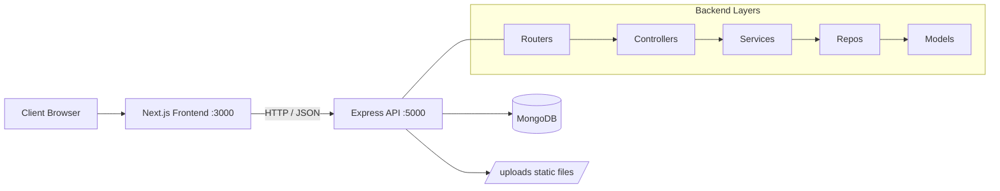

# Restaurant Reservation & Menu Platform

A full-stack web application for browsing meals, creating table bookings, and managing restaurant operations through an admin panel.

## Tech Stack

### Frontend
- Next.js 15 (App Router)
- React 18
- Tailwind CSS
- Axios

### Backend
- Node.js + Express
- MongoDB + Mongoose
- JWT authentication
- Multer file uploads

## System Architecture



## Project Structure

```text
restaurant/
├── backend/
│   ├── app.js
│   ├── config/
│   ├── controllers/
│   ├── middlewares/
│   ├── models/
│   ├── repos/
│   ├── routers/
│   ├── services/
│   ├── validators/
│   └── uploads/
└── frontend/
	├── src/app/
	├── src/components/
	├── src/atoms/
	└── public/
```

## How The App Works

1. User interacts with Next.js pages and components.
2. Frontend sends requests to backend endpoints on `http://localhost:5000/api/...`.
3. Express routers forward requests to controllers.
4. Controllers call service and repository layers to process business logic and database operations.
5. MongoDB stores users, meals, bookings, and notifications.
6. Uploaded meal images are served from `/uploads` and rendered by Next.js.

## API Modules

- `/api/auth` : signup, login, logout
- `/api/users` : profile, user list (admin), user bookings
- `/api/menu` : list meals, meals by category, create/update/delete meals (admin)
- `/api/bookings` : create booking, list/update pending bookings (admin)
- `/api/notifications` : list and mark notifications as read

## Prerequisites

- Node.js 18+
- npm 9+
- MongoDB Atlas cluster or local MongoDB instance

## Environment Setup

Create `backend/.env` with:

```env
NODE_ENV=development
MONGO_URI=mongodb+srv://<username>:<password>@<cluster-host>/<db-name>?retryWrites=true&w=majority
PORT=5000
JWT_SECRET=your_strong_secret
JWT_EXPIRATION=1d
```

Notes:
- Do not wrap values in quotes unless required.
- If you use a local database, use a URI like `mongodb://127.0.0.1:27017/restaurant`.

## Install Dependencies

From the project root, install backend and frontend packages:

```bash
cd backend
npm install

cd ../frontend
npm install
```

## Run The App (Development)

Open 2 terminals.

### Terminal 1: Backend

```bash
cd backend
npm start
```

Expected log:

```text
Server is running on port 5000
MongoDB Connected: <host>
```

### Terminal 2: Frontend

```bash
cd frontend
npm run dev
```

Open: `http://localhost:3000`

## Build For Production

### Frontend

```bash
cd frontend
npm run build
npm start
```

### Backend

Use a production process manager (for example PM2) to run `node app.js`.

## Default Ports

- Frontend: `3000`
- Backend: `5000`

## Common Troubleshooting

### Backend crashes with `querySrv ENOTFOUND`

Cause:
- Invalid MongoDB Atlas host in `MONGO_URI`, or DNS/network cannot resolve the SRV record.

Fix:
1. Verify the cluster host in Atlas connection string.
2. Ensure your internet/DNS is working.
3. Test with local MongoDB URI to isolate Atlas issues.

### Images do not load

Check:
1. Backend is running on port `5000`.
2. Image URL starts with `http://localhost:5000/uploads/...`.
3. `frontend/next.config.mjs` allows that host and path.

### CORS or auth errors

Check:
1. Backend is running before frontend requests.
2. JWT token is present and valid for protected routes.
3. Admin-only routes are called by admin users.

## Security Notes

- Never commit real secrets in `.env`.
- Rotate JWT secrets and database passwords if exposed.
- Restrict MongoDB Atlas network access to trusted IPs.

## Future Improvements

- Add Docker Compose for one-command local startup.
- Add automated tests (API + frontend).
- Centralize frontend API base URL in environment variables.
- Add CI pipeline for lint/build/test.
